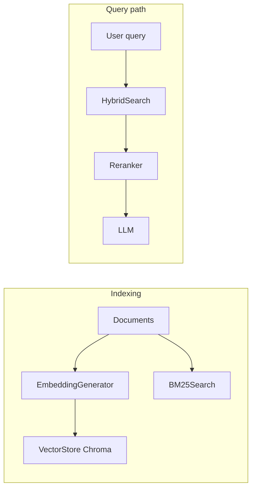

# RAG Assistant

A production-oriented Retrieval-Augmented Generation (RAG) stack using open-source components: **hybrid retrieval** (Chroma dense search + BM25), optional **cross-encoder reranking**, and generation via **Ollama** (local), **Hugging Face Inference** (cloud), or an optional **Transformers** fallback. Includes a **Streamlit** UI, scripts for ingestion, and an evaluation layer (`ragas` + `datasets`; see [`requirements.txt`](requirements.txt)).

**Cost:** Local inference with Ollama has no API fees; cloud LLMs may require a Hugging Face token (free tier exists but may be rate-limited).

---

## Table of contents

1. [Features](#features)
2. [Tech stack](#tech-stack)
3. [Repository layout](#repository-layout)
4. [Quick start](#quick-start)
5. [Installation](#installation)
6. [Usage](#usage)
7. [Configuration](#configuration)
8. [Architecture](#architecture)
9. [Indexing and query behavior](#indexing-and-query-behavior)
10. [Evaluation](#evaluation)
11. [Deployment](#deployment)
12. [Docker](#docker)
13. [Python 3.13 and optional packages](#python-313-and-optional-packages)
14. [Windows installation notes](#windows-installation-notes)
15. [Troubleshooting](#troubleshooting)
16. [Optimization](#optimization)
17. [Performance expectations](#performance-expectations)
18. [FAQ](#faq)
19. [License and acknowledgments](#license-and-acknowledgments)

---

## Features

- **Hybrid search:** Dense vectors (sentence-transformers) plus BM25; configurable weights.
- **Reranking:** Cross-encoder (`cross-encoder/ms-marco-MiniLM-L-6-v2` by default) with threshold and top-k.
- **Smart chunking:** Table-aware extraction — markdown tables kept as single chunks; prose split by paragraph → sentence → word with section-heading prefix automatically prepended.
- **Multimodal (LLaVA):** Embedded charts and figures in PDFs described by LLaVA via Ollama; MD5-deduped, capped at 20 per document, 30 s per-image timeout, live progress bar.
- **Multi-turn conversation memory:** Last 3 exchanges injected into the LLM prompt so follow-up questions (e.g. "And what about Kerala?") resolve correctly.
- **Page citations:** Every chunk tagged `[Page N]`; LLM instructed to cite page numbers in answers.
- **LLM backends:** Ollama (`LLM_TYPE=ollama`), Hugging Face Inference (`LLM_TYPE=huggingface`), or local Transformers (`LLM_TYPE=transformers`).
- **Persistence:** Chroma stores embeddings under `cache/vectorstore`; reset uses ChromaDB API (no `shutil.rmtree` stale-lock issues on macOS/APFS).
- **Caching:** In-memory answer cache in `RAGPipeline` with TTL (keyed by query + context; see [Configuration](#configuration)).
- **UI:** Streamlit chat for research docs with `.pdf/.doc/.docx` uploads and runtime sidebar controls.
- **Fresh-session indexing:** Startup reset and upload-time replacement so stale vectors are never reused.
- **Evaluation:** `evaluation/evaluator.py` (RAGAS) and `evaluation/metrics.py` (extra retrieval/similarity helpers).

---

## Tech stack

| Layer | Technology |
|-------|------------|
| Embeddings | Sentence-Transformers (`all-MiniLM-L6-v2` default) |
| Vector store | Chroma (cosine, persistent) |
| Sparse search | BM25 (`rank-bm25`) |
| Reranker | Sentence-Transformers CrossEncoder |
| PDF extraction | `pdfplumber` (structured, table-aware) + `pypdf` (fallback) |
| Image extraction | `pymupdf` (fitz) + LLaVA via Ollama |
| LLM | Ollama / Hugging Face / Transformers |
| UI | Streamlit |
| Config | `pydantic-settings`, `.env` |
| Logging | loguru |

---

## Repository layout

```
traditional-rag/
├── config.py                 # Settings (env + defaults)
├── main.py                   # Example CLI-style demo
├── streamlit_app.py          # Web UI
├── requirements.txt
├── Dockerfile
├── src/
│   ├── embeddings.py         # EmbeddingGenerator
│   ├── vectorstore.py        # Chroma VectorStore
│   ├── bm25_search.py        # BM25Search
│   ├── hybrid_search.py      # HybridSearch
│   ├── reranker.py           # Reranker
│   ├── llm.py                # Ollama / HuggingFace / Transformers
│   └── rag_pipeline.py       # RAGPipeline orchestration
├── evaluation/
│   ├── evaluator.py          # RAGAS wrapper (requires ragas + datasets)
│   └── metrics.py            # Additional metrics
├── scripts/
│   ├── ingest_documents.py   # File ingestion + optional pickle
│   └── evaluate.py           # Dataset loader (extend for full runs)
├── data/                     # Sample / user documents
├── cache/                    # Chroma persistence (vectorstore)
└── logs/
```

---

## Quick start

**Prerequisites:** Python 3.10+ (3.13 supported with current `requirements.txt`), ~4GB+ RAM for small models, disk for downloads.

```bash
cd traditional-rag
python -m venv venv
source venv/bin/activate          # Windows: venv\Scripts\activate
pip install -r requirements.txt
# Optional: create `.env` with secrets (e.g. HF_TOKEN=...). Defaults work from config.py.
```

**LLM (pick one):**

- **Ollama (local):** Install [Ollama](https://ollama.ai), run `ollama serve`, then `ollama pull mistral` (or another model). Defaults in `config.py` point to `http://localhost:11434`.
- **Hugging Face (cloud):** Create a token at [huggingface.co/settings/tokens](https://huggingface.co/settings/tokens). Set `LLM_TYPE=huggingface` in `config.py` or via env. The app reads the token from the **`HF_TOKEN`** environment variable (see `config.py`).

**Run the UI:**

```bash
streamlit run streamlit_app.py
```

Open [http://localhost:8501](http://localhost:8501). Use the **Documents** tab to upload `.pdf`, `.doc`, or `.docx`, then **Chat**.

**Run the demo script:**

```bash
python main.py
```

**Ingest files from disk:**

```bash
python scripts/ingest_documents.py path/to/file1.txt path/to/file2.md
```

---

## Installation

### Virtual environment

```bash
python -m venv venv
source venv/bin/activate    # macOS/Linux
# venv\Scripts\activate     # Windows
pip install --upgrade pip
pip install -r requirements.txt
```

### Environment variables

Copy `.env.example` to `.env` if present. Important variables:

| Variable | Purpose |
|----------|---------|
| `HF_TOKEN` | Hugging Face API token (used by `Settings` for cloud LLM) |
| `LOG_LEVEL` | Logging verbosity (e.g. `DEBUG`) |

`config.py` uses `pydantic-settings`; field names there map to env vars (e.g. uppercased settings).

### Ollama models (examples)

```bash
ollama pull mistral        # default LLM (balanced)
ollama pull neural-chat    # smaller / faster
ollama pull orca-mini      # lightweight
ollama pull llava          # vision model for chart/figure description
```

Match `OLLAMA_MODEL` in `config.py` to the pulled model name.

---

## Usage

### Streamlit (recommended)

```bash
streamlit run streamlit_app.py
```

Features: document upload (`pdf/doc/docx`) with chunking, chat history, retrieved-doc expander, and runtime sidebar controls for search/rerank/generation/cache.

Important behavior:
- On app startup, previous persisted index data is removed automatically.
- On each new upload batch, prior indexed data is deleted and replaced by the new batch.

### Python API

```python
from src.rag_pipeline import RAGPipeline

rag = RAGPipeline()
rag.add_documents(["Paragraph one...", "Paragraph two..."])
result = rag.query("Your question?")

print(result["answer"])
print(result["context"])
print(result["retrieved_docs"])
```

### Command-line ingestion

```bash
python scripts/ingest_documents.py doc1.txt doc2.md --output cache/indexed_docs.pkl
```

Splits files on blank lines (`\n\n`) into chunks before indexing. Also calls `save_documents()` on the pipeline when finished.

### Research-paper / government-report defaults

The default configuration is tuned for dense structured documents (academic PDFs, government statistics reports):
- `VECTOR_WEIGHT=0.8`, `BM25_WEIGHT=0.2`
- `TOP_K_RETRIEVAL=20`, `TOP_K_RERANK=8`
- `RERANKER_SCORE_THRESHOLD=0.05`
- `CHUNK_SIZE=900`, `CHUNK_OVERLAP=150` (words; smart chunker respects natural boundaries first)
- `TEMPERATURE=0.25`, `TOP_P=0.9`, `MAX_NEW_TOKENS=800`

**Smart chunker behaviour (UI uploads):**
1. Markdown table blocks (`| ... |` lines) → kept as **one chunk each** (never word-split).
2. Prose → split by paragraph (`\n\n`), then sentence, then word-level overlap as last resort.
3. Section headings (markdown `#`, bold `**Title**`, or ALL-CAPS short lines) are detected and prepended as context to subsequent chunks.

**LLaVA figure extraction limits (UI uploads):**
- Minimum image size: 200 × 200 px (cuts logos, bullets, decorative elements)
- Max figures per document: 20
- Per-image timeout: 30 seconds (hung images skipped with warning)
- Duplicate images (same bytes, different pages): described once via MD5 deduplication

---

## Configuration

Edit [`config.py`](config.py) or set environment variables. Highlights:

| Area | Keys (examples) |
|------|------------------|
| Models | `EMBEDDING_MODEL`, `RERANKER_MODEL`, `OLLAMA_MODEL`, `HUGGINGFACE_MODEL` |
| LLM mode | `LLM_TYPE`: `ollama` \| `huggingface` \| `transformers` |
| Hybrid | `HYBRID_SEARCH_ENABLED`, `VECTOR_WEIGHT`, `BM25_WEIGHT`, `TOP_K_RETRIEVAL` |
| Rerank | `RERANKING_ENABLED`, `TOP_K_RERANK`, `RERANKER_SCORE_THRESHOLD`, `RERANKER_BATCH_SIZE` |
| Generation | `TEMPERATURE`, `TOP_P`, `MAX_NEW_TOKENS`, `MAX_CONTEXT_LENGTH` |
| Chunking (defaults for pipeline-aware callers) | `CHUNK_SIZE`, `CHUNK_OVERLAP` |
| Cache | `CACHE_ENABLED`, `CACHE_TTL` (TTL is defined in settings; in-memory cache in `rag_pipeline` does not expire by TTL automatically—extend if needed) |
| Paths | `VECTORSTORE_PATH` (under `cache/`), `LOG_FILE` |

**Note:** `VECTORSTORE_TYPE` may mention FAISS; the implemented store is **Chroma only**.

**Hugging Face LLM:** Set `LLM_TYPE=huggingface` and provide `HF_TOKEN` for `HuggingFaceLLM`.

---

## Architecture



**Orchestration:** [`src/rag_pipeline.py`](src/rag_pipeline.py) — `retrieve()` → optional rerank (with a “broad query” shortcut that limits aggressive reranking) → context string → strict RAG prompt → `llm.generate()` → optional cache.

**Components:**

| Module | Responsibility |
|--------|----------------|
| `embeddings.py` | SentenceTransformer encode / singleton |
| `vectorstore.py` | Chroma add/query; cosine distance → similarity |
| `bm25_search.py` | BM25Okapi, simple tokenization |
| `hybrid_search.py` | Embeds query, merges vector + BM25 scores by doc id |
| `reranker.py` | CrossEncoder scores; threshold with fallback |
| `llm.py` | Ollama HTTP, HF router endpoint, optional Transformers pipeline |

---

## Indexing and query behavior

**Indexing:** `HybridSearch.add_documents` embeds texts, writes to Chroma, rebuilds BM25 in memory. Metadata defaults to `{"id": i}` per batch.

**Persistence:** Vectors persist on disk. BM25 is **in-memory**; after a restart, if Chroma still has documents but the process never called `add_documents` in that session, hybrid search may use **vector-only** until documents are re-ingested.

**Smart chunking (UI uploads):** Tables are extracted as markdown by `pdfplumber` and kept as single chunks. Prose goes through paragraph → sentence → word recursive splitting with the active section heading prepended as context. `scripts/ingest_documents.py` still uses a simple double-newline split for plain text.

**Chroma IDs:** Batches use `doc_0` … `doc_{n-1}`. Re-indexing uses the ChromaDB API (`delete_collection` + `get_or_create_collection`) to avoid stale file-lock issues on macOS/APFS.

---

## Evaluation

### RAGAS

Listed in [`requirements.txt`](requirements.txt) (`ragas`, `datasets`). If import fails on your Python version, remove those lines from requirements and reinstall, or upgrade: `pip install ragas datasets --upgrade`.

```python
from evaluation.evaluator import get_evaluator

evaluator = get_evaluator()
scores = evaluator.evaluate_response(
    query="...",
    context="...",
    ground_truth="...",
    generated_answer="...",
)
```

Batch API: `evaluate_batch(...)`. Reports: `create_report(results)`.

### CLI scaffold

```bash
python scripts/evaluate.py --dataset evaluation_dataset.json --output cache/evaluation_results.json
```

The script loads the dataset and evaluator; wire it to your RAG outputs for full end-to-end scoring.

### JSON dataset shape (example)

```json
[
  {
    "question": "What is machine learning?",
    "ground_truth": "...",
    "relevant_contexts": ["..."]
  }
]
```

---

## Deployment

### Cloud constraint

**Ollama is local-only** for typical deployments. For Hugging Face Spaces, Streamlit Cloud, or other hosts without Ollama, set **`LLM_TYPE=huggingface`** and provide **`HF_TOKEN`** in the platform’s secrets.

### Hugging Face Spaces

1. Create a Space with SDK **Streamlit**, Python **3.10+** (this repo’s README frontmatter targets 3.13; align with Space runtime).
2. Push this repository or upload files.
3. Add secret **`HF_TOKEN`** (or mirror your `config.py` expectations).
4. Ensure `config.py` uses `LLM_TYPE=huggingface` for cloud generation.

The YAML **frontmatter at the top of this file** is valid for Hugging Face Spaces metadata (`app_file: streamlit_app.py`). If you maintain a separate Space-only README, you can copy that header.

**Optional model hints for Spaces** (legacy pattern):

```yaml
models:
  - sentence-transformers/all-MiniLM-L6-v2
  - cross-encoder/ms-marco-MiniLM-L-6-v2
```

### Streamlit Cloud

Connect the GitHub repo, main branch, entrypoint `streamlit_app.py`, add `HF_TOKEN` in secrets if using Hugging Face LLM.

### Railway / Render / Fly.io

Use the included [`Dockerfile`](Dockerfile) or platform-specific Python build; expose port **8501**.

### Production checklist

- Cloud LLM + secrets configured
- No committed `.env` or tokens
- Test cold start and model download time
- Consider smaller `TOP_K_RETRIEVAL` / `BATCH_SIZE` on CPU tiers

---

## Docker

```bash
docker build -t rag-assistant .
docker run -p 8501:8501 rag-assistant
```

The image runs Streamlit on `0.0.0.0:8501`. For Ollama from the container you must run Ollama elsewhere and point `OLLAMA_BASE_URL` to a reachable host.

---

## Python 3.13 and optional extras

- **Core stack** in [`requirements.txt`](requirements.txt) targets Python **3.10+** including **3.13**. If **`ragas` / `datasets`** fail to install, delete those two requirement lines—core RAG (`streamlit`, `main.py`, ingestion) works without them; evaluation helpers will warn and skip metrics.
- **FAISS:** Not used by this codebase; **Chroma** is the vector store. Only add `faiss-cpu` if you introduce a different backend yourself.

Quick check:

```bash
python -c "from src.rag_pipeline import RAGPipeline; print('OK')"
```

---

## Windows installation notes

**Long paths / Microsoft Store Python:** If installs fail under long `WindowsApps` paths, prefer **python.org** installers with “Add to PATH”, or enable **Win32 long paths** (Group Policy: Computer Configuration → Administrative Templates → System → Filesystem → Enable Win32 long paths), then reboot.

**Alternative:** Use **Miniconda/Anaconda** with `conda create -n rag python=3.13` and install from `requirements.txt` inside the environment.

Typo note (some guides): use `gpedit.msc` for Local Group Policy Editor.

---

## Troubleshooting

| Symptom | Things to try |
|---------|----------------|
| Cannot connect to Ollama | Run `ollama serve`; check `OLLAMA_BASE_URL`; open `http://localhost:11434/api/tags` |
| LLaVA not describing figures | Run `ollama pull llava`; ensure Ollama is running; enable the checkbox in the Documents tab |
| LLaVA very slow | Normal: ~20 s per figure. Cap is 20 figures/doc; raise `_LLAVA_MIN_PX` to filter more aggressively |
| HF errors / auth | Set `HF_TOKEN`; ensure `LLM_TYPE=huggingface` |
| `ModuleNotFoundError: ragas` | `pip install ragas datasets` |
| Out of memory | Smaller Ollama model; reduce `BATCH_SIZE`, `TOP_K_RETRIEVAL`; disable reranking |
| Slow answers | Enable cache; reduce retrieval top-k; smaller models |
| Empty retrieval | Index documents first; check Chroma path and permissions |
| Chat tab not unlocking after upload | Should auto-unlock; if not, click any other tab then return to Chat |
| RAGAS context format | Evaluator splits context on lines; ensure retrieved context is compatible |

Logs: `logs/app.log`, `logs/streamlit.log`.

---

## Optimization

- **Latency:** Cache on; smaller embedding/rerank models; lower `TOP_K_RETRIEVAL`.
- **Quality:** Reranking on; tune `VECTOR_WEIGHT` / `BM25_WEIGHT`; increase retrieval before rerank; upload more pages.
- **Memory:** Lower batch sizes; shorter `MAX_NEW_TOKENS`.
- **LLaVA speed:** Raise `_LLAVA_MIN_PX` in `streamlit_app.py` to filter smaller images; lower `_LLAVA_MAX_IMAGES` cap; skip LLaVA for text-heavy documents with no meaningful charts.

---

## Performance expectations

Rough timings (Apple M-series / modern CPU):

| Step | Typical range |
|------|----------------|
| PDF text extraction (pdfplumber) | 1–5 s per 100 pages |
| Smart chunking | negligible (pure Python) |
| Embed batch | ~0.5 s per tens of chunks |
| Vector + BM25 hybrid | tens of ms at modest corpus sizes |
| Rerank | ~100–300 ms |
| LLM (Mistral via Ollama) | 5–30 s depending on answer length |
| LLaVA per figure | ~15–30 s (20-figure cap = max ~10 min) |
| End-to-end query | ~3–15 s |

---

## FAQ

**Does it work offline?** Yes, with Ollama and cached models, after initial downloads.

**How much disk?** Models dominate (often multiple GB for LLMs); Chroma grows with corpus.

**Can I add a custom LLM?** Extend `src/llm.py` and `get_llm()`.

**Is commercial use allowed?** MIT license—verify third-party model licenses separately.

**Evaluate quality?** Use RAGAS + your labeled pairs; `scripts/evaluate.py` is a starting point for automation.

---

## Future enhancements

- Query expansion, semantic routing, agents/tool use
- Streaming generation
- Parent-child retrieval (small chunk retrieval → large chunk to LLM)
- Configurable LLaVA image cap and min-size via UI sidebar

---

## License and acknowledgments

**License:** MIT

**Contributing:** Issues and PRs welcome (metrics, backends, chunking, evaluation harness).

**Acknowledgments:** Sentence-Transformers, Chroma, Ollama, Streamlit, RAGAS, Hugging Face, rank-bm25, PyTorch/transformers ecosystem.

---

Built with open-source tools; local Ollama usage avoids paid APIs.
